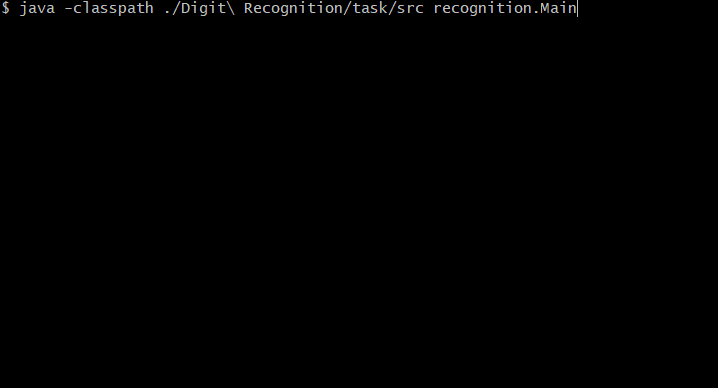

# Digit Recognition
:muscle: Hard :link: [hyperskill](https://hyperskill.org/projects/51)

>Neural networks: what a trend nowadays! It might seem like a kind of magic, but upon completing this project, you’ll see that you are already competent enough to build your own neural network. Your network will be able to recognize numeric data, allowing you to digitize checks and even figure out some captchas. If you aren’t too intimidated by words like “sigmoid” or “backpropagation”, click select and let’s get started!

## Learning outcomes
Take a journey from building your first neuron at the first stage to fully understanding the workings of OOP at the last one. As a bonus, you can expand your expertise way beyond Java: check out some cool resources on machine learning.
|||||||
|-|-|-|-|-|-|
|#matrix|#neurons|#neural-network|#digit-recognition|#machine-learning|#sigmoid|

## Usage


## Setup
* [Install JDK 11](https://www.oracle.com/java/technologies/javase-jdk11-downloads.html)
* Clone repository
```
git clone https://github.com/mroui/jetbrains-academy-java.git
```
* Enter Digit Recognition directory
```
cd jetbrains-academy-java/Digit\ Recognition
```
* Compile java files
```
javac ./Digit\ Recognition/task/src/recognition/*.java
```
* Run Digit Recognition
```
java -classpath ./Digit\ Recognition/task/src recognition.Main
```
