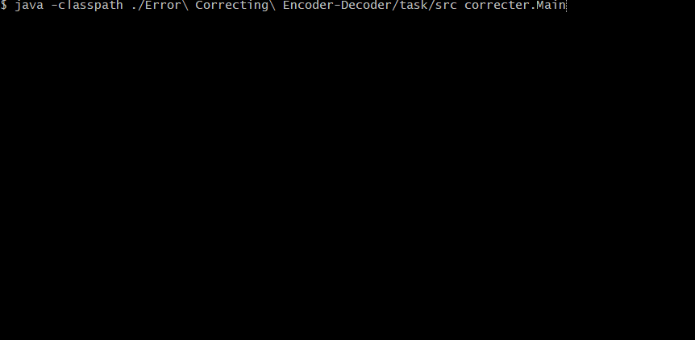

# Error Correcting Encoder-Decoder
:muscle: Medium :link: [hyperskill](https://hyperskill.org/projects/58)

>Errors are inevitable both in life and in the digital world. Errors occur here and there and everywhere, and in this project you will not only imitate this process, but also learn how to cope with errors. It is a chance to experience what early developers had to cope with at the dawn of the computer era. Low-level programming is fun and insightful: try it and you’ll see.

## Learning outcomes
Gain a more profound understanding of essential basics and figure out bytes bit by bit. Practice loops and working with files.
|||||||||
|-|-|-|-|-|-|-|-|
|#java-basics|#console|#encryption|#decryption|#error-emulation|#operations-on-bytes|#bit-parity|#hamming-code|

## Usage


## Setup
* [Install JDK](https://www.oracle.com/pl/java/technologies/javase-downloads.html)
* Clone repository
```
git clone https://github.com/mroui/jetbrains-academy-java.git
```
* Enter Error Correcting Encoder-Decoder directory
```
cd jetbrains-academy-java/Error\ Correcting\ Encoder-Decoder
```
* Compile java files
```
javac ./Error\ Correcting\ Encoder-Decoder/task/src/correcter/*.java
```
* Run Numeral System Converter
```
java -classpath ./Error\ Correcting\ Encoder-Decoder/task/src correcter.Main
```
