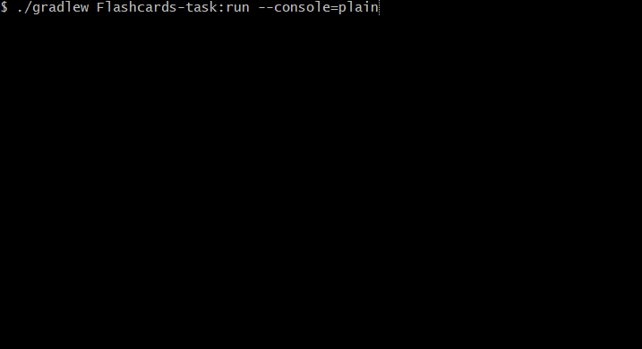

# Flashcards
:muscle: Hard :link: [hyperskill](https://hyperskill.org/projects/44)

>When learning a new language, it can be hard to remember all the new vocabulary, which is exactly where flashcards can help. Typically, flashcards show a hint (a task or a picture) on one side and the right answer on the other. Flashcards can be used to remember any sort of data, so if you want to create a useful tool to help your learning and your programming skills, this project is for you.

## Learning outcomes
In this project, you will learn how to work with files and call them from the command line.
||||||||||
|-|-|-|-|-|-|-|-|-|
|#flashcards|#command-line|#OOP|#streams|#lambda|#file-operations|#JSON|#Gson|#parsing-args|

## Usage


## Setup
* [Install JDK 11](https://www.oracle.com/java/technologies/javase-jdk11-downloads.html)
* Clone repository
```
git clone https://github.com/mroui/jetbrains-academy-java.git
```
* Enter Flashcards directory
```
cd jetbrains-academy-java/Flashcards
```
* Run with Gradle Flashcards task with/without arguments, for example:
```
./gradlew Flashcards-task:run
./gradlew Flashcards-task:run --console=plain
./gradlew Flashcards-task:run --args="-import flashcards.txt"
./gradlew Flashcards-task:run --args="-export new_flashcards.txt"
./gradlew Flashcards-task:run --args="-import flashcards.txt -export new_flashcards.txt"
```

## Copyright
* [Gson](https://github.com/google/gson)