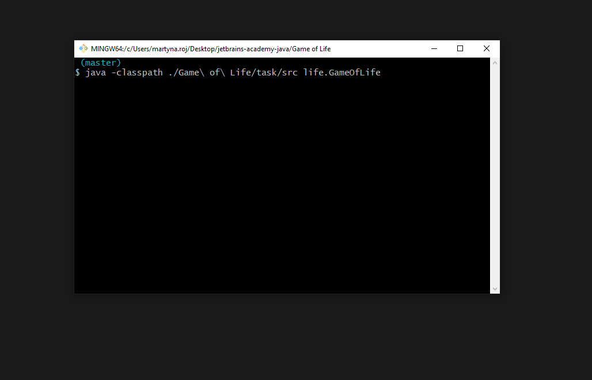

# Game of Life
:muscle: Medium :link: [hyperskill](https://hyperskill.org/projects/54)

>Get firsthand experience of creating a small inhabited universe and observe the many patterns in which this “life” can evolve. Generation by generation, watch the cells come and go, reacting to their environment, perishing from loneliness or finding comfort in company. In this project, you will write a simple “Game of Life”, a classic toy for programmers to entertain and educate themselves. Careful: might be hypnotizing!

## Learning outcomes
Practice using Swing library for creating GUI and get confident working with Random class and multithreading.
|||||||
|-|-|-|-|-|-|
|#swing|#game-of-life|#timer|#game-loop-engine|#event-listeners|#object-oriented|

## Usage


## Setup
* [Install JDK](https://www.oracle.com/pl/java/technologies/javase-downloads.html)
* Clone repository
```
git clone https://github.com/mroui/jetbrains-academy-java.git
```
* Enter Game of Life directory
```
cd jetbrains-academy-java/Game\ of\ Life
```
* Compile java files
```
javac ./Game\ of\ Life/task/src/life/*.java
```
* Run Game of Life
```
java -classpath ./Game\ of\ Life/task/src life.GameOfLife
```
