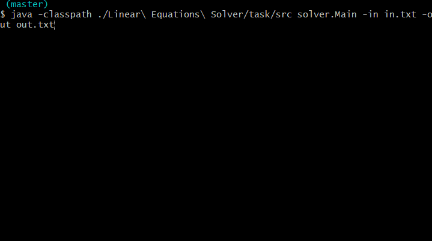

# Linear Equations Solver
:muscle: Hard :link: [hyperskill](https://hyperskill.org/projects/40)

>You’ve come so far! Yet sometimes it’s nice to get back to old and simple basics: shall we remember some linear algebra? In this project, you will write a program that solves linear equations (you wish you had it back at school, don’t you?) It won’t be working with powers and radicals, but on the other hand, it will be able to handle matrices.

## Learning outcomes
Practice the ever-useful essentials (classes, arrays, files) and learn to handle matrices.
|||||||
|-|-|-|-|-|-|
|#algebra|#matrices|#linear-equations|#gauss-elimination|#files|#command-line-arguments|

## Usage


## Setup
* [Install JDK 11](https://www.oracle.com/java/technologies/javase-jdk11-downloads.html)
* Clone repository
```
git clone https://github.com/mroui/jetbrains-academy-java.git
```
* Enter Linear Equations Solver directory
```
cd jetbrains-academy-java/Linear\ Equations\ Solver
```
* Compile java files
```
javac ./Linear\ Equations\ Solver/task/src/solver/*.java
```
* Run Linear Equations Solver with arguments for input or also for output file, for example:
```
java -classpath ./Linear\ Equations\ Solver/task/src solver.Main -in in.txt
java -classpath ./Linear\ Equations\ Solver/task/src solver.Main -in in.txt -out out.txt
```

## Example
Suppose you have a file named ```in.txt``` with the following content:
```
3
1 1 2 9
2 4 -3 1
3 6 -5 0
```
Which corresponds to the following equation:
```
{ 1 * x1 + 1 * x2 + 2 * x3 = 9
{ 2 * x1 + 4 * x2 - 3 * x3 = 1
{ 3 * x1 + 6 * x2 - 5 * x3 = 0
```
And then the file out.txt should look like this:
```
1,000
2,000
3,000
```