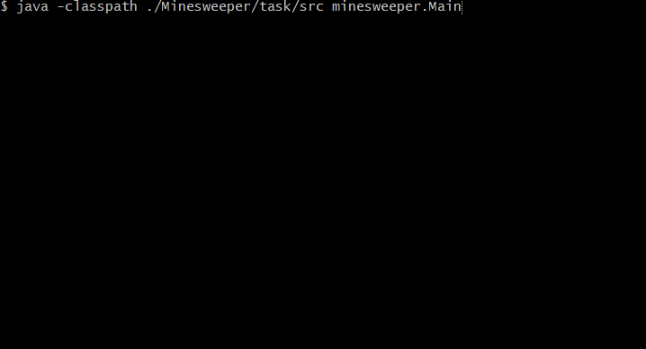

# Minesweeper
:muscle: Hard :link: [hyperskill](https://hyperskill.org/projects/77)

>You played this game when the Internet cut off, didn’t you? It is time to remember the good old days. In this project, you will create your own "Minesweeper" game.

## Learning outcomes
This project will teach you how to work with multidimensional arrays in Java. You will be dealing with algorithms for generating the playfield and processing player moves. You will also find out what collections and stacks are.
|||||||
|-|-|-|-|-|-|
|#java-basics|#console-game|#1player|#OOP|#std-input-output|#2d-array|

## Usage


## Setup
* [Install JDK 11](https://www.oracle.com/java/technologies/javase-jdk11-downloads.html)
* Clone repository
```
git clone https://github.com/mroui/jetbrains-academy-java.git
```
* Enter Minesweeper directory
```
cd jetbrains-academy-java/Minesweeper
```
* Compile java files
```
javac ./Minesweeper/task/src/minesweeper/*.java
```
* Run Minesweeper
```
java -classpath ./Minesweeper/task/src minesweeper.Main
```
