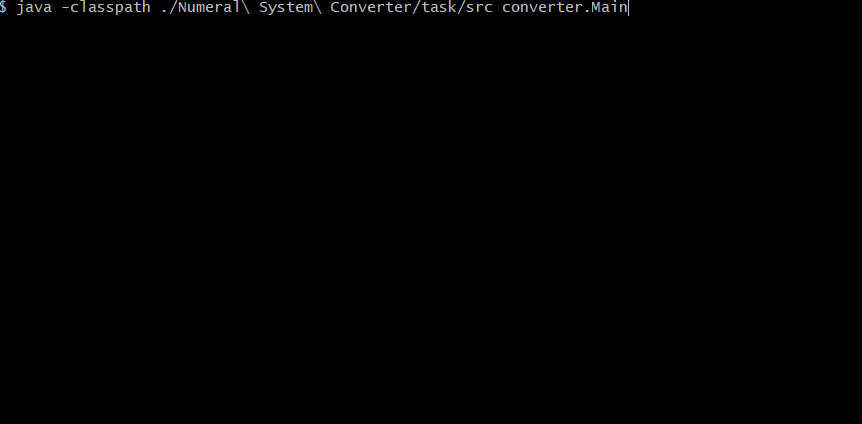

# Numeral System Converter
:muscle: Medium :link: [hyperskill](https://hyperskill.org/projects/41)

>We’re all quite used to our good old decimal system of numerals. But let’s not forget that there are countless other ways to count! Whether we convert numbers from one system to another just for fun or to store large data more efficiently, a converter would be helpful. In this project you will create a mathematical helper that will help you convert numbers from system M to system N.

## Learning outcomes
Master loops and arrays, and learn how to handle errors. And besides, explore binary — one of the basic concepts in programming.
|||||||
|-|-|-|-|-|-|
|#java-basics|#console|#numeral-systems|#error-handling|#from-to-any-radix|#floatings|

## Usage


## Setup
* [Install JDK](https://www.oracle.com/pl/java/technologies/javase-downloads.html)
* Clone repository
```
git clone https://github.com/mroui/jetbrains-academy-java.git
```
* Enter Numeral System Converter directory
```
cd jetbrains-academy-java/Numeral\ System\ Converter
```
* Compile java files
```
javac ./Numeral\ System\ Converter/task/src/converter/*.java
```
* Run Numeral System Converter
```
java -classpath ./Numeral\ System\ Converter/task/src converter.Main
```
