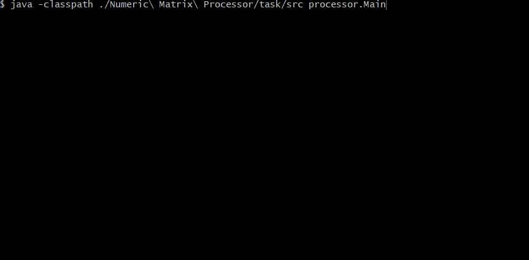

# Numeric Matrix Processor
:muscle: Medium :link: [hyperskill](https://hyperskill.org/projects/60)

>Here’s a project for devoted matrix enthusiasts: learn to perform a variety of operations on matrices including addition, multiplication, finding the determinant, and dealing with inverse matrices. If you are working on your tech or math major, this project is a good chance for you to learn matrices in action and not just in your notebook.

## Learning outcomes
Apart from learning a whole lot about matrices, you will become familiar with the Math library, recursion, and the many ways of using arrays in practice.
||||||||
|-|-|-|-|-|-|-|
|#java-basics|#console|#matrices|#arrays|#math-operations|#recursion|#error-handling|

## Usage


## Setup
* [Install JDK](https://www.oracle.com/pl/java/technologies/javase-downloads.html)
* Clone repository
```
git clone https://github.com/mroui/jetbrains-academy-java.git
```
* Enter Numeric Matrix Processor directory
```
cd jetbrains-academy-java/Numeric\ Matrix\ Processor
```
* Compile java files
```
javac ./Numeric\ Matrix\ Processor/task/src/processor/*.java
```
* Run Numeric Matrix Processor
```
java -classpath ./Numeric\ Matrix\ Processor/task/src processor.Main
```
