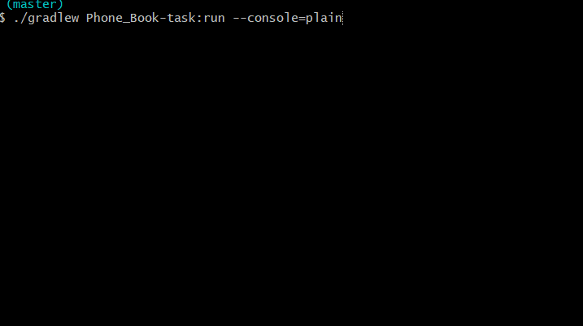

# Phone Book
:muscle: Hard :link: [hyperskill](https://hyperskill.org/projects/63)

>You suddenly remember you need to call your aunt and wish her a happy birthday, but how do you find her number quickly in a giant phonebook? Write a program that will solve this problem once and forever: create a phonebook where you can easily, quickly and efficiently find necessary information. Names and numbers, here we come.

## Learning outcomes
You will learn a variety of sorting and search algorithms, one of which is recursive. If it is algorithm competence that you’re after, this project is definitely for you.
|||||||||
|-|-|-|-|-|-|-|-|
|#OOP|#algorithms|#hashtable|#buble-sort|#quick-sort|#binary-search|#linear-search|#jump-search|

## Usage


## Setup
* [Install JDK 11](https://www.oracle.com/java/technologies/javase-jdk11-downloads.html)
* Clone repository
```
git clone https://github.com/mroui/jetbrains-academy-java.git
```
* Enter Phone Book directory
```
cd jetbrains-academy-java/Phone\ Book
```
* Edit directory.txt file (or let it be default):
```
notepad Phone\ Book/task/files/directory.txt
```
* Fill file with your own contacts like this:
```
phone_number firstname surname
OR
phone_number name
```
* Edit find.txt file (or let it be default):
```
notepad Phone\ Book/task/files/find.txt
```
* Fill file with your contacts that you want to find, like this:
```
firstname surname
OR
name
```
* Run with Gradle Phone Book task.
```
./gradlew Phone_Book-task:run --console=plain
```