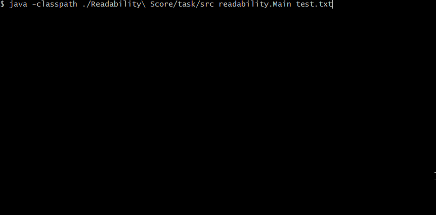

# Readability Score
:muscle: Medium :link: [hyperskill](https://hyperskill.org/projects/39)

>Everyone has their own personal reading history, and as we grow up, we are able to comprehend more and more complicated texts. But how do you estimate the level of difficulty of a given text, and how do you teach a computer to do that? In this project, you will find it out: write a program that determines how difficult the text is and for which age it is most suitable.

## Learning outcomes
Learn to call programs from the command-line and get more experience with using regexes and Math class.
|||||||||
|-|-|-|-|-|-|-|-|
|#java-basics|#console|#files|#string-class|#regex|#math-operations|#handling-errors|#functions|

## Usage


## Setup
* [Install JDK](https://www.oracle.com/pl/java/technologies/javase-downloads.html)
* Clone repository
```
git clone https://github.com/mroui/jetbrains-academy-java.git
```
* Enter Readability Score directory
```
cd jetbrains-academy-java/Readability\ Score
```
* Compile java file
```
javac ./Readability\ Score/task/src/readability/Main.java
```
* Run Readability Score with file as parameter, f.e. test.txt
```
java -classpath ./Readability\ Score/task/src readability.Main test.txt
```
