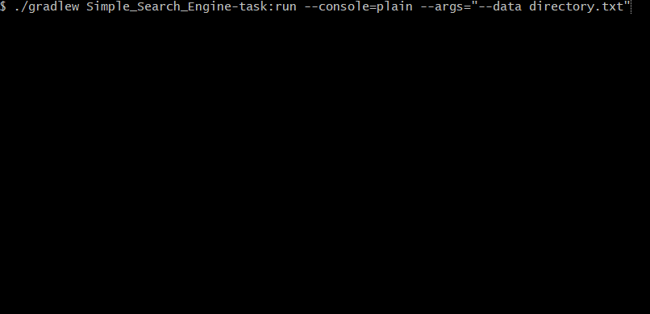

# Simple Search Engine
:muscle: Hard :link: [hyperskill](https://hyperskill.org/projects/66)

>Create your own search engine! It probably won’t compete with Google: yours will be a simple version which processes some data and searches it for a word or a phrase. Simple but cool.

## Learning outcomes
Gain confidence in working with files and console, and learn how to optimize the search process.
|||||||
|-|-|-|-|-|-|
|#OOP|#searching|#string-class|#string-comparisions|#file-operations|#std-input-output|

## Usage


## Setup
* [Install JDK 11](https://www.oracle.com/java/technologies/javase-jdk11-downloads.html)
* Clone repository
```
git clone https://github.com/mroui/jetbrains-academy-java.git
```
* Enter Simple Search Engine directory
```
cd jetbrains-academy-java/Simple\ Search\ Engine
```
* OPTIONAL: Edit directory.txt file (or let it be default):
```
notepad Simple\ Search\ Engine/task/directory.txt
```
* OPTIONAL: Fill file with your own contacts like this:
```
firstname surname phone_number
OR
firstname surname
```
* Run with Gradle Simple Search Engine task with/without directory.txt file.
```
./gradlew Simple_Search_Engine-task:run --console=plain
./gradlew Simple_Search_Engine-task:run --console=plain --args="--data directory.txt"
```