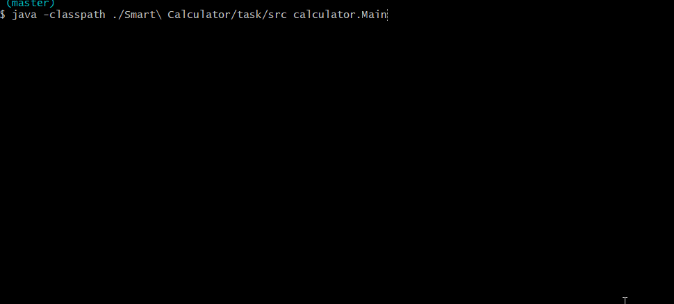

# Smart Calculator
:muscle: Hard :link: [hyperskill](https://hyperskill.org/projects/42)

>Calculators are a very helpful tool that we all use on a regular basis. Why not create one yourself, and make it really special? In this project, you will write a calculator that not only adds, subtracts, and multiplies, but is also smart enough to remember your previous calculations.

## Learning outcomes
Apart from writing a useful program (everyone uses calculators!), you will learn a lot about arrays, stacks, strings, and queues. You will also get closer experience with 2 important data structures: the stack and the queue. You will also get a closer experience with BigInteger class that allows storing large volumes of data with precision for geo-data or physical quantities.

||||||||||
|-|-|-|-|-|-|-|-|-|
|#calculator|#console|#regex|#parsing|#equations|#stack|#postfix|#reverse-polsh-notation|#+-*/^()|

## Usage


## Setup
* [Install JDK 11](https://www.oracle.com/java/technologies/javase-jdk11-downloads.html)
* Clone repository
```
git clone https://github.com/mroui/jetbrains-academy-java.git
```
* Enter Smart Calculator directory
```
cd jetbrains-academy-java/Smart\ Calculator
```
* Compile java files
```
javac ./Smart\ Calculator/task/src/calculator/*.java
```
* Run Smart Calculator
```
java -classpath ./Smart\ Calculator/task/src calculator.Main
```
