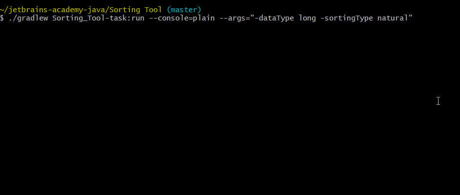

# Sorting Tool
:muscle: Hard :link: [hyperskill](https://hyperskill.org/projects/45)

>In the modern world, data has become so abundant that processing it is no easy business. How can anyone make sense of all these words and numbers? In this project, you will write a program that processes textual and numeric data and sorts it. Your program will be able to determine the biggest or most frequent pieces of data and perform the necessary calculations on them. Data is waiting to be sorted!

## Learning outcomes
Become familiar with Collections and learn to work with files, arguments, and the command line.
|||||||||
|-|-|-|-|-|-|-|-|
|#sorting|#sorting-strings|#sorting-numbers|#OOP|#streams|#lambda|#file-operations|#parsing-args|

## Usage


## Setup
* [Install JDK 11](https://www.oracle.com/java/technologies/javase-jdk11-downloads.html)
* Clone repository
```
git clone https://github.com/mroui/jetbrains-academy-java.git
```
* Enter Sorting Tool directory
```
cd jetbrains-academy-java/Sorting\ Tool
```
* Run program with specified arguments in ```--args```, for example:
```
./gradlew Sorting_Tool-task:run --console=plain --args="-dataType long -sortingType natural"
./gradlew Sorting_Tool-task:run --console=plain --args="-dataType word -sortingType byCount"
./gradlew Sorting_Tool-task:run --console=plain --args="-dataType line -inputFile input.txt"
./gradlew Sorting_Tool-task:run --console=plain --args="-inputFile input.txt"
./gradlew Sorting_Tool-task:run --console=plain --args="-sortingType byCount -dataType line -inputFile input.txt -outputFile output.txt"
```

* -dataType can be [long|word|line] - word by default
* -sortingType can be [natural|byCount] - natural by default
* Without -inputFile data will be read from console
* Without -outputFile data will be written only to the console
