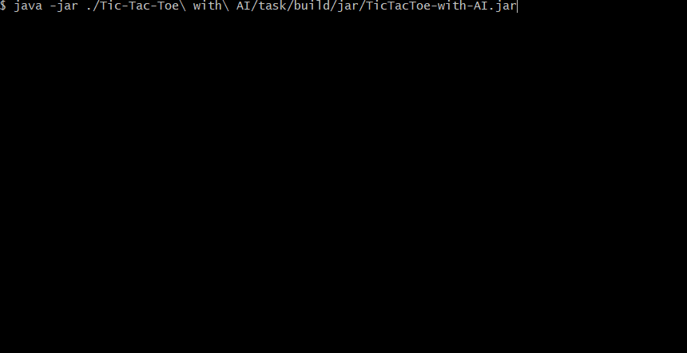

# Tic-Tac-Toe with AI
:muscle: Medium :link: [hyperskill](https://hyperskill.org/projects/81)

>Everybody remembers this paper-and-pencil game from childhood: Tic-Tac-Toe, also known as Noughts and crosses or Xs and Os. A single mistake usually costs you the game, but thankfully it is simple enough that most players discover the best strategy quickly. Let’s program Tic-Tac-Toe and get playing!
## Learning outcomes
After finishing this project, you'll get to know a lot about planning and developing a complex program from scratch, using classes and methods, handling errors, and processing user input. You will also learn to use OOP (Object-Oriented Programming) in the process.
|||||||||||
|-|-|-|-|-|-|-|-|-|-|
|#console-game|#minimax-algorithm|#2players|#AI-vs-AI|#player-vs-AI|#player-vs-AI|#easy-medium-hard-levels|#OOP|#inheritance|#abstraction|

## Usage


## Setup
* [Install JDK](https://www.oracle.com/pl/java/technologies/javase-downloads.html)
* [Install Apache Ant] (https://ant.apache.org/)
* Clone repository
```
git clone https://github.com/mroui/jetbrains-academy-java.git
```
* Enter 'Tic-Tac-Toe with AI' directory
```
cd jetbrains-academy-java/Tic-Tac-Toe\ with\ AI/
```
* Create executable jar with Ant
```
ant build
```
* Run Tic-Tac-Toe with AI executable file
```
java -jar ./Tic-Tac-Toe\ with\ AI/task/build/jar/TicTacToe-with-AI.jar
```
