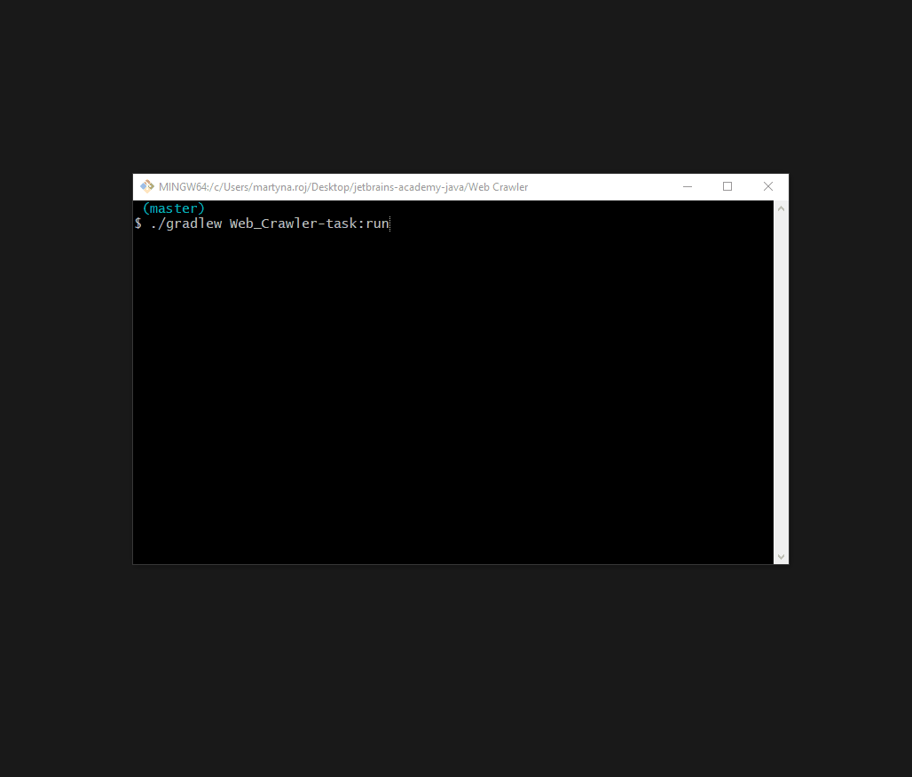

# Web Crawler
:muscle: Challenging :link: [hyperskill](https://hyperskill.org/projects/59)

>The Web is called so for a reason: all these pages are connected to many others through links, resembling a spider’s web. It’s easy to get lost and miss important links, so in this project you will write a program that might help. A Web Crawler collects and saves links from a given page, storing them in the memory for you to access later.

## Learning outcomes
You seem like a quite advanced user! Here you will gain even more skills: get to know Swing library and learn how to distribute tasks among the threads and control them.
||||||||||
|-|-|-|-|-|-|-|-|-|
|#swing|#url|#url-connections|#regex|#patterns|#html-parser|#hyperlinks-parser|#event-listeners|#object-oriented|

## Usage


## Setup
* [Install JDK 11](https://www.oracle.com/java/technologies/javase-jdk11-downloads.html)
* Clone repository
```
git clone https://github.com/mroui/jetbrains-academy-java.git
```
* Enter Web Crawler directory
```
cd jetbrains-academy-java/Web\ Crawler
```
* Run by Gradle Web Crawler application.
```
./gradlew Web_Crawler-task:run
```
